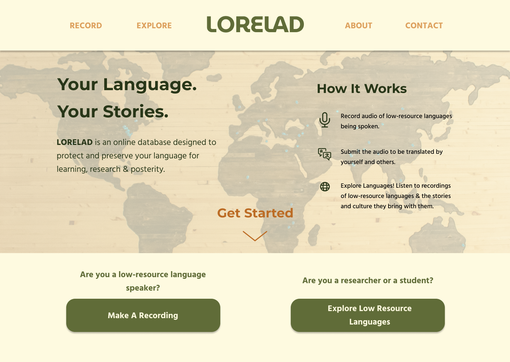
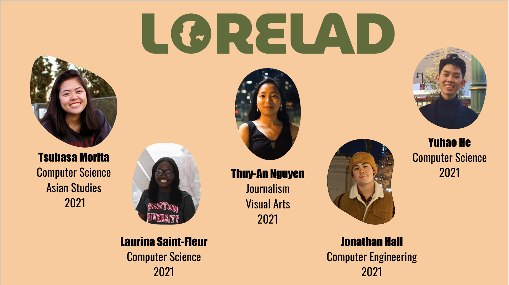

# BU Spark! Project - LORELAD

This is a repo for BU Spark! project. The goal for this project is to provide a platform to help spread the stories and culture of unrepresented languages.

This project won the 1st place in the 2021 BU Spark! competition/projects presentation.

## Project Structure
The project is divided into two parts: frontend and backend. The frontend is built with React and the backend is built with Django and connected to PostgreSQL.

All the UX Design Assets are in the `UX Design Assets` folder.

## Website Overview

## Getting Started
To start the django server:

python backend/manage.py runserver

join on mainthread.

to install all requirements
-set up virtualenv first (google virtualenv)

run: 

pip intall -r requirements.txt

## Team Members
